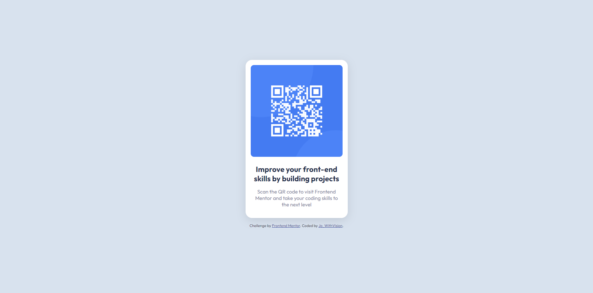

# Frontend Mentor - QR code component solution 

This is a solution to the [QR code component challenge on Frontend Mentor](https://www.frontendmentor.io/challenges/qr-code-component-iux_sIO_H). Frontend Mentor challenges help you improve your coding skills by building realistic projects. 

:tada::computer: Live Preview: [Preview URL here](#)

## Table of contents

- [Overview](#overview)
  - [Screenshot](#screenshot)
  - [Links](#links)
- [My process](#my-process)
  - [Built with](#built-with)
  - [What I learned](#what-i-learned)
  - [Continued development](#continued-development)
- [Author](#author)

## Overview

Frontend Mentor's perfect first challenge for those new to the platform or new to HTML and CSS. A simple QR code component, displayed in a card layout with rounded corners in the center of the viewport.

### Screenshot

### Links (coming soon)

- Solution URL: [Add solution URL here](#)
- Live Site URL: [Add live site URL here](#)

## My process (WIP)

Included within the Initial commit:

1. Tidied up the FM directory, removing the design folder and style guide and updating the README.md with my own information.

2. Improved the starter HTML by adding main and article sectioning elements to contain my solution (as the QR component is a complete and shareable piece of content, article seemed like the appropriate semantic tag). I added the FM attribution inside a footer sectioning element and added my name and FM profile to the link.

3.  Created an external stylesheet and linked to it within the HTML head section.

4. Included the import for the appropriate Google Font in the CSS.

5. Declared basic styling for colours and padding as variables in the CSS, using the style guide information (although I didn't go ahead with paragraphs at 15px, as I thought the root 16px looked best and wanted to use 1rem as my normal font variable).

6. Added the universal selector and box-sizing set to border-box to make measurements easier.

7. I added the HTML markup and contents I believed I would need to achieve the solution, based on decisions made when re-building the design in Figma. 

8. I wrote the CSS for the card first - setting its general appearance based on the Figma design measurements for rounded corners, gap and padding, using my variables where appropriate.

9. I then set it's flex properties to columns, as this design has vertically stacked elements.

10. To make sure the design displayed in the center of the viewport I added flex properties to a container div. I used width: 100vh, despite knowing there are issues with mobile display, but as this project does not contain Javascript, it seemed like my only option. I created a media query to increase the top-padding when on a small device such as the iPhone SE to improve display - but I was not able to decide on a solution for displaying on smaller screens than 375, such as the Galaxy Fold, with my current knowledge of responsive web design. 

11. I then worked on the h1 and p text, by creating another flex-container so that I could have a different gap and padding from the image. I used a fixed width to set the text flex container smaller than the image. There didn't seem to be any difference from the desktop and mobile view of the design for this challenge.

12. I added a subtle box-shadow to the card.

13. I re-wrote the code provided by FM for their attribute to use my custom variables and change the px font-size to a rem conversion. I also included pseudo-classes for the anchor links, changing the colour on hover, active and focus for usability (checking the colour against the background with a contrast checker). 

### Built with

- Semantic HTML5 markup
- CSS custom properties (aka variables)
- Flexbox

### What I learned
I learnt that checking the appearance on difference devices in Google Chrome inspector highlighted my need for further study in designing for smaller screens. I tested the code out on Google Chrome inspect and on Edge and Firefox. I am happy with the display down to 375px, but I will need to increase my knowledge of responsive design to make better choices with future challenges. 

### Continued development
Responsive web design
media queries
CSS frameworks

## Author

- GitHub profile - [Jo_WithVision](https://github.com/Jo-with-vision)
- Frontend Mentor - [@Jo-with-vision](https://www.frontendmentor.io/profile/Jo-with-vision)

